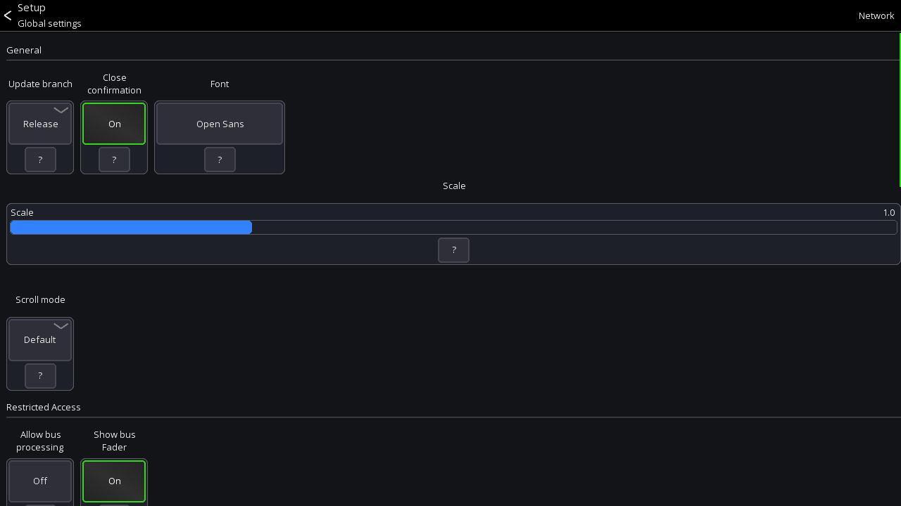

# Global settings

There are two places for configuring global settings:

- The `Global settings` view allows you to change generic settings such as UI scale, scroll behaviour or network
  interfaces
- The `App settings` view allows you to change settings related to the mixing UI

## Global settings

### Open settings

The app settings can be opened via the menu from the `start view` (directly after opening the app)

```
Menu -> Gear icon
```



### Update branch

> Desktop version only

Configures which branch to use when checking for updates.

## Close confirmation

> Desktop version only

When enabled, the app will ask the user for confirmation before closing

## Font

Defines which font should be used. Depending on the language that you're using you may need to change
fonts in order for the characters to be correctly displayed.

### Scale

Changes the UI scale of the app.

### Scroll mode

Allows you to invert the mouse / touchpad scroll direction or disable it entirely.

### Access bus processing

When enabled, a user with restricted access to a single bus is allowed to access the processing of that bus.

### Access bus fader

When enabled, a user with restricted access will see the main bus fader on the right side of the screen.

### Autostart

Autostart allows you to configure which mixer the app should connect to when starting.
This is useful for installation purposes where the app should always connect to a mixer without user interaction.

### API

Only available on Desktop platform. Enables {{ abbr('API') }} access for Mixing Station.

### Auto reconnect

When enabled, the app automatically reconnects to the mixer in the case of a connection error.

### Network

On the top right you can access the network interface settings.
These settings are for advanced network configurations.