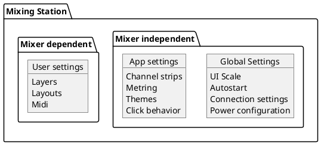

# Settings

This page explains how the app stores settings.

There are 3 different settings categories described in the following diagram:



The settings are recalled by the following logic:

```plantuml
start
:Open app;
:Load Global settings;
:Load App settings;
if ("default" user settings entry\n for current mixer available?) then (yes)
:Load "default" User Settings for \ncurrent mixer model;
else (no)
endif

if (Got Layout with "Open on startup" behavior?) then (yes)
:Load "Open on startup" layout;
else (no)
   if (Got Layout with "Mixer override" behavior?) then (yes)
   :Load "Mixer override" layout;
   else (no)
   :Show regular mixer;
   endif
endif
end
```

Click one of the following links to find out more about
the different settings types:
- [Global settings](global.md)
- [App settings](app.md)
- [User settings](user.md)


## Backup / Restore

To create a backup of  **all** settings, select the `gear icon` after starting the app, and
select `Backup / Restore`.
You can back up all your data to a local file, or your Mixing Station account.


### Export / Import settings

See [user settings](user.md)

