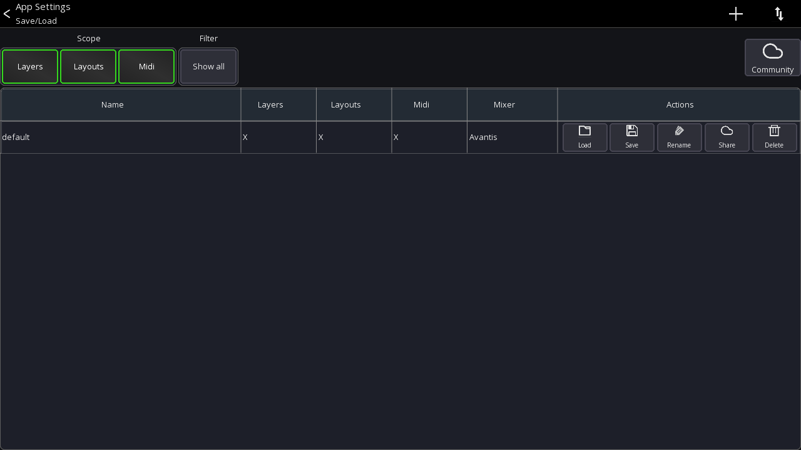

# Settings
This page explains how the app stores settings.

There are 4 different settings categories as follows: Global, Console Series, App, and User.

| Name | Scope | Custom saves (import/export) possible |
| ---- | --- | --- |
| Global settings | Applies to the entire app | No |
| Console Series settings | Applies to a console series / Android app | No |
| App settings | Applies to the entire app | No |
| User settings | Applies to a specific mixer model | Yes |

## Global settings
These settings apply to the whole app. On Android, these settings apply to all app instances.

- All app UI / UX related configuration (scale, slider sensitivity and behaviour, ...)
- Network interface settings

## Console series settings
These settings apply to the currently selected mixer series (for example the `XM32`).

- [Permissions configuration](../getting-started.md#permissions)
- IP address of the mixer


## App settings
These settings are also global for the entire app and let you change UI/UX related settings, for example the [Channel strip](channel-strip.md).
```
Menu -> Setup (gear icon)
```


## User settings
These settings are saved automatically by default (see `Autosave`). You can also save them manually.

- [Layer](../layers.md)
- [Layouts](../custom-layouts.md)
- [Midi](../midi.md)

To manually save the settings, open:
```
Menu -> Setup (gear icon) ->  Folder icon
```




Use the scope buttons to select which settings should be saved or loaded.
**Press and hold** an entry to open a context menu.

### Backup / Restore
To backup **all** settings of the entire app, select the `gear icon` after starting the app, and select `Backup / Restore`.
You can backup all your data to a local file, or your Mixing Station account.


### Export / Import settings
There are two ways to share `User settings` settings as follows:

1. Via the `Community` share feature (requires a Mixing Station account)
2. Via the operating system


### Using the Community feature
#### Upload
1. Open the context menu for a setting entry.
2. Select `Upload` You might be prompted to log in with your Mixing Station account.
 If your browser is too old (e.g. iOS 9), you can also open to this url from any other browser: 
 [https://dev-core.org/mixing-station/community/msSettings/stash](https://dev-core.org/mixing-station/community/msSettings/stash)
3. A browser will open (you might need to log in again) and you can enter additional meta data.
4. Once saved, the setting is stored online and can be accessed from any device using your account. If you enabled public sharing, other users can also download your settings.

#### Download
1. Press the `Community` button in the app to view your settings and all settings you have bookmarked from other users.


### Share settings via the operating system
1. Open the context menu and select `OS share`.

Depending on the platform, multiple share options are available.
For importing, you can use the arrow menu button or select the file you want to import in a file explorer and open it with Mixing Station.
