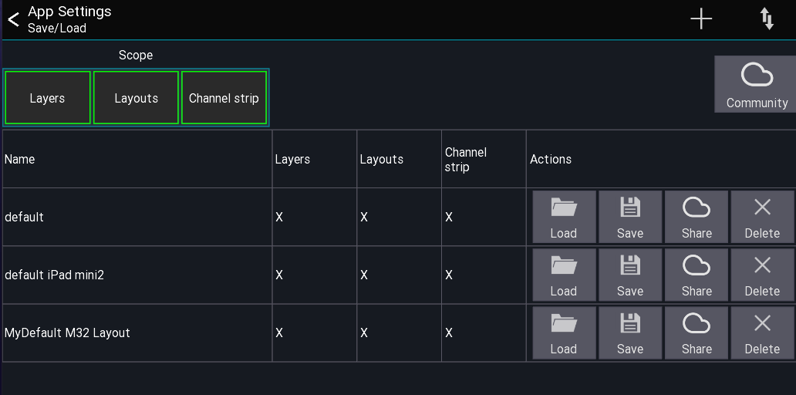

# Settings
This page explains how the app stores settings.

There are 4 different settings categories: Globa, Series, Session and user settings.

| Name | Scope | Custom saves (import/export) possible |
| ---- | --- | --- |
| Global settings | Applies to all apps | No |
| Console series settings | Applies to a console series / Android app | No |
| Session settings | Applies to connected/offline mode | No |
| User settings | Applies to connected/offline mode | Yes |

## Global settings
These settings apply to the whole app. On android these settigns apply to all app instances.

- Update branch
- UI scale
- Network interface settings

## Console series settings
These settings apply to the currently selected mixer series (or a single android app).

- Restricted access config
- Last IP address and mix access


## Session settings
These settings are saved when starting / closing the app and are stored for each mixer model separatly.

- All app UI / UX related configuration
- Mutegroup names

## User settings
These settings are only saved if `Autosave` is enabled or the user saves them manualy.

- [Layer](../layers.md)
- [Channel strip](channel-strip.md)
- [Layouts](../custom-layouts.md)
- [Midi](../usb-midi.md)

To manualy save the settings open:
```
Menu -> Setup (gear icon) ->  Folder icon
```




Use the scope buttons to select which settings should be saved or loaded.
**Press and hold** an entry to open a context menu.

### Export / Import settings
There are two ways to share `User settings` settings:

1. Via the `Community` share feature (requires a mixing station account)
2. Via the operating system


### Using the Community feature
#### Upload
1. Open the context menu for a setting entry
2. Select `Upload`, you might be prompted to login with your mixing station account.
 If your browser is too old (e.g. ios 9) you can also open to this url from any other browser: 
 [https://dev-core.org/mixing-station/community/msSettings/stash](https://dev-core.org/mixing-station/community/msSettings/stash)
3. A browser will open (you might need to login again) and you can enter additional meta data
4. Once saved the setting has been stored online and can be accessed from any device using your account. If you enabled public sharing other uses can also download your settings.

#### Download
1. Press the `Community` button in the app. You will see all of your settings and all settings you have bookmarked from other users.


### Share settings via the operating system
1) Open the context menu and selecting `OS share`.

Depending on the platform, multiple share options are available.
For importing you can use the arrow menu button or select the file you want to import in a file explorer and open it with mixing station.
