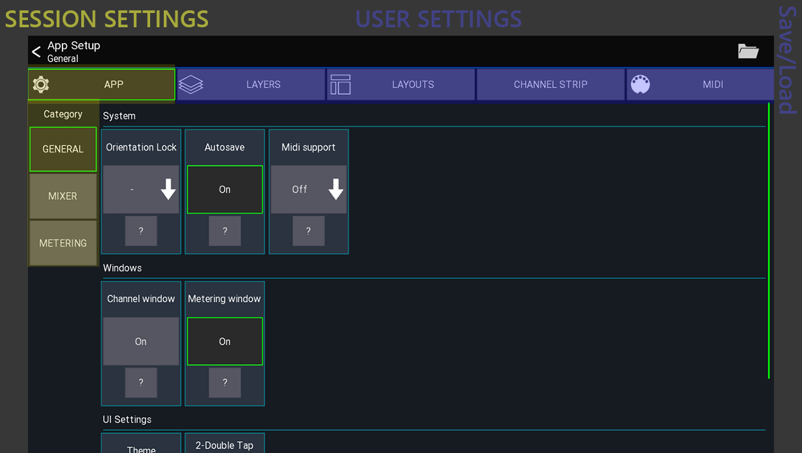
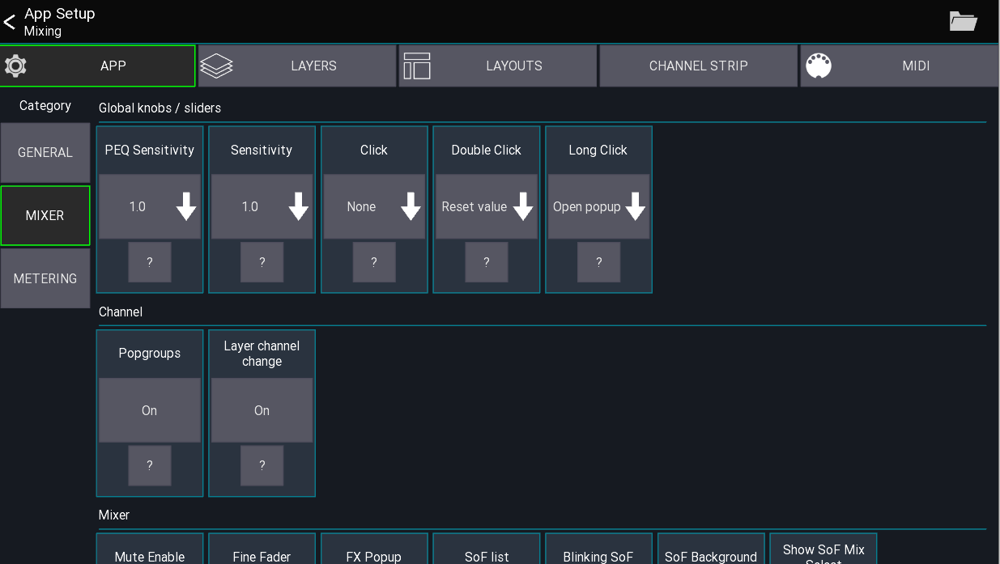
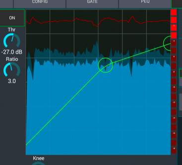

# Session settings
This page gives an overview over the available session settings

## Open settings
The app settings can be opened via the menu from the *mixer view*
```
Menu -> Setup -> App
```

## General tab

In the general tab, all settings which affect the whole app are shown.
You can press the `?` for more details. Some special settings are explained here in more detail.

#### Example
The option is enabled and your current layer configuration looks like this
```
Band
	Ch 1
	Ch 2
	Ch 3
	Ch 5
Vocal
	Ch 11
	Ch 13
	Ch 14
```
Opening `Ch 5` and pressing the `->` will change the view to `Ch 11` instead of `Ch 6`


### USB Midi
Enables the USB midi stack. This should only be enabled if you're using this functionality as it consumes more battery.

## Mixer tab

These settings are related to the mixer and channel views

### Knobs / Sliders
This section configures how the knob and sliders should behave. This setting is applied to all knobs in the app, excep sliders in a channel strip. These can be configured in the `Channel Strip` tap.

### Metering
In this section you can configure everything related to meters and RTA.

#### Gate/Dyn Timeline
Enables a history plot of the gate/dynamics input and gain reduction signal.



### Channel
All channel related settings can be found here

#### Popgroups
Enables a midas pro style popgroup functionality.
When tapping on a channel button of a DCA/group the assigned channels will be shown in the mixer instead of opening the DCA/group. To edit an DCA/IDCA while popgroup mode is enabled **press and hold** the channel button.

#### Layer channel change
By default the `<-` and `->` buttons in the channel view will go to the next / previous channel of the mixer, regardless of the current layer configuration in the app.
Enabling this option will follow the layer configuration instead.

##### IDCA
When selecting an IDCA in popgroup mode the shown channels do **not** follow the currently selected sends on fader selection. Instead the assigned target mix of the IDCA will be used.
