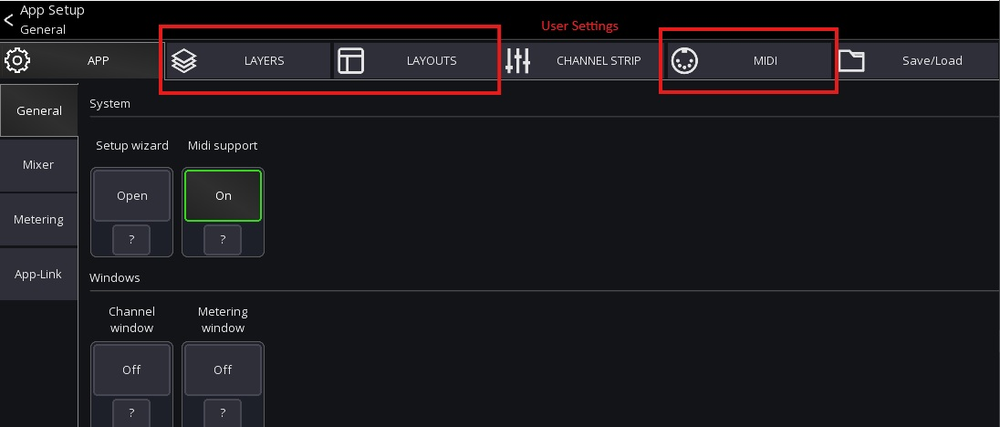

# User Settings

The user settings store the following items:

- [Layers](../layers.md)
- [Layouts](../custom-layouts.md)
- [Midi](../midi.md)



When `Autosave` is enabled those settings are stored 
automatically as an entry called `default`.


## Manage settings
The user settings view can be opened via the menu from the *mixer view*

```
Menu -> Setup (gear icon) -> Save/Load
```


From here you can manually save/load and export the user settings.

To save the current configuration, press the `+` symbol in the top menu.
This will save all the items selected in the `Scope` section of the screen.

The `Scope` is also used to filter which settings will be loaded.

### Export / Import settings

There are two ways to share `User settings` settings as follows:

1. Via the `Community` share feature (requires a Mixing Station account)
2. Via the operating system

### Using the Community feature

#### Upload

1. Open the context menu for a setting entry.
2. Select `Upload` You might be prompted to log in with your Mixing Station account.
   If your browser is too old (e.g. iOS 9), you can also open to this url from any other browser:
   [https://mixingstation.app/community/msSettings/stash](https://mixingstation.app/community/msSettings/stash)
3. A browser will open (you might need to log in again) and you can enter additional meta data.
4. Once saved, the setting is stored online and can be accessed from any device using your account. If you enabled
   public sharing, other users can also download your settings.

#### Download

1. Press the `Community` button in the app to view your settings and all settings you have bookmarked from other users.

### Share settings via the operating system

1. Open the context menu and select `OS share`.

Depending on the platform, multiple share options are available.
For importing, you can use the arrow menu button or select the file you want to import in a file explorer and open it
with Mixing Station.
