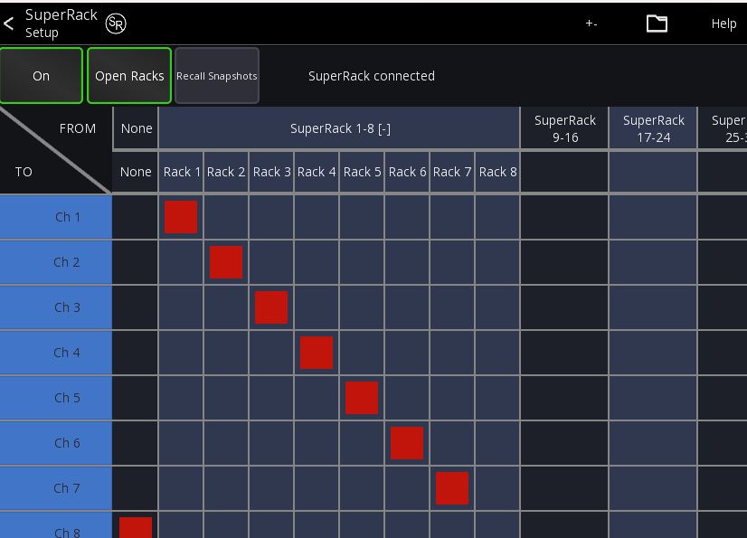
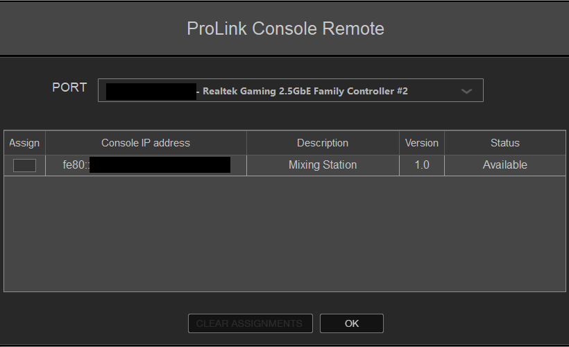
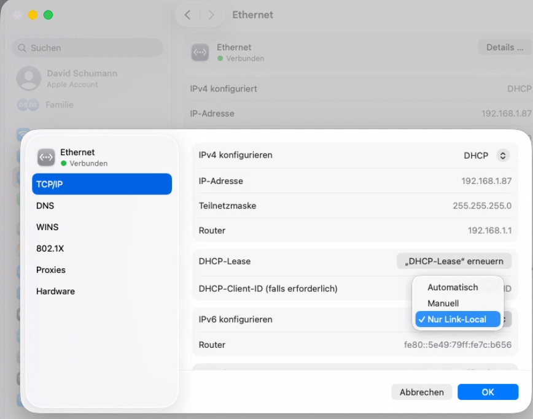

# Waves SuperRack

This integration allows Waves SuperRack to follow the selected
channel in Mixing Station, as well as recall matching snapshots

## Requirements

- Mixing Station >=3.2.0
- Waves SuperRack
- IPv6 network (link local only)
- Mixing Station SuperRack license or subscription (can be tested without)

Mixing Station and Waves SuperRack must be running
on devices which have IPv6 enabled.
This is required by the ProLink protocol.

## Setup

1. In Mixing Stations main menu press `SuperRack`
   and press the On/Off button to enable the integration.

   

2. In SuperRack go to Setup
3. Add a new Controller "Pro Link Console Remote"
4. Press the gear icon to open the ProLink configuration.
   You should see a "Mixing Station" entry. Press "Assign" on the left side.
   
5. Mixing Station should now show "SuperRack connected".

## Open Racks

This option opens a rack in SuperRack whenever the channel
selection in Mixing Station changes.

In the selection grid you can select
which mixer channel corresponds to which
rack.

## Recall Snapshot

When enabled a SuperRack snapshot will be recalled
every time the "current scene" value changes (aka you recall a scene on your desk).

In addition, the currently selected scene will be highlighted in SuperRack as well.

The mapping for this is always 1:1, meaning when you recall
Scene 5, it will also recall Snapshot 5 in SuperRack.


## Common Issues

### Only link-local IPv6 address allowed

This error appears if your network interface has more than one ipv6 address.
This usually happens if your network supports IPv6 natively 
(for example if your router hands out IPv6 prefixes).

The SuperRack protocol however doesn't work in such situations (Waves is aware of this, but it's not 
seen as a bug...).

To prevent this from happening, make sure to use a network that is NOT connected to the internet.

In case you can't change the network you're using then there are other workarounds:
You can disable router discovery on your system. Note however that this will
disable IPv6 communication with the outside world.

#### For Windows
1. Open a powershell as admin
2. List all interfaces to find the correct name
    ```powershell
    Get-NetIPInterface -AddressFamily IPv6
    ```
3. To disable router discovery:
   ```powershell
   Set-NetIPInterface -InterfaceIndex <ifIndex number> -AddressFamily IPv6 -RouterDiscovery "Disabled"
   ```
   
To revert simply pass `Enabled` instead of `Disabled` at the end of the command


#### For macOS

1. Open the system settings
2. Navigate to "Network"
3. Click on your network interface
4. Press `Details`
5. Press `IPC/IP`
6. Change the IPv6 configuration to `Local-Link Only`


