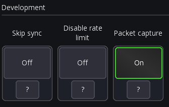
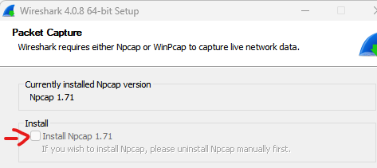
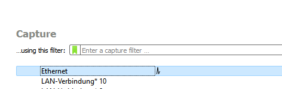
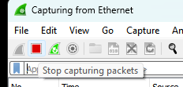

# Packet Capture

This page describes how to capture packets. This is only required if you have been
instructed by the support to do so.

## In-App

This section describes how to capture packes using the built-in capture feature.

1. You need Mixing Station 2.5.0 or newer
2. Open the app -> Gear icon -> `Global`
3. Scroll down to the `Development` section and enable `Packet capture`: 
4. Go back and connect to your mixer and execute the action instructed by support
5. Once done: Press the `...` menu button -> Disconnect
6. Gear icon -> `Create Backup`. You can store the backup on your device or if an internet connection
   is available use MS Community to upload it
7. Once the backup has been stored disable the capture mode again (see step 1-2)

## Wireshark

This section describes how to capture the network traffic using wireshark. This should only be done if requested by
support
for resolving very specific issues.

## Setup

- Install wireshark from [the official page](https://www.wireshark.org/download.html)
    - Make sure to select `Install Npcap` if not already installed.
       
- Install the editor software of the mixer

## Capture

1. Start wireshark as administrator
2. Double-click on your network interface
   
3. Start the editor software of the mixer
4. Connect to the mixer
5. Once the software has been connected to the mixer and synchronized all the data, stop the capture 
    
6. Click on `File -> Save as` and save the capture.