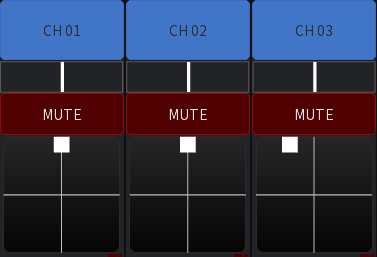
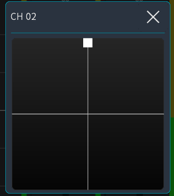

# Surround Panning

Mixing Station support quadro surround panning (4.0) on all mixers.

## Requirements
You need two stereo (or linked) busses for the front and rear channel.
The main channel is not used by the panner to ensure phase alignment.

## Setup

1. Connect to your mixer / start offline mode
2. Press the gear icon -> `Surround Pan`
3. Select the bus that should be used for the front and rear channel
4. Press `Enable`, then select `Apply`
5. Enable the `Surr.Pan` element in the [channel strip settings](settings/channel-strip.md)

> These settings are kept for the specific mixer model. So you usually only need to set it up once.

## Disable
To disable the surround pan mode:

1. Press the gear icon -> `Surround Pan`
2. Disable the `Enable` button, then select `Apply`

## Usage
Click on the surround panner in your channel strip to open the panning dialogue:

In here you can either:

- Press anywhere to immediately move the pan position
- Drag the white pan indicator
- Double tap anywhere to reset pan to the closest axis