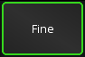
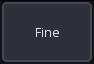
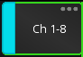
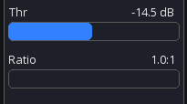
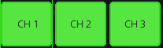

# UI Controls

This page describes the most common UI controls and how to use them.

Note: When using a mouse, use can also **right-click** instead of **press and hold**.

## Buttons

| On                                                   | Off                                                    |
|------------------------------------------------------|--------------------------------------------------------|
|  |  |

### Long click

Buttons with an indicator (`...`) in the top right have a long-click action.
This will usually open additional details about the parameter.

## Knobs

### Default behaviour

- **Drag** to change the value
- **Press and hold** to open a popup for more precise control
- **Double tap** to open a popup for more precise control

This behaviour can be configured in the [app settings](settings/app.md).

### Dragging

Knob values can be increased by dragging them up or to the right.
When dragging to the top right, the values will increase more rapidly.
To decrease the value just use the opposite direction as shown in the image below.

## Faders

Drag the fader knob to change the value. If **fine mode** is enabled you can start dragging the fader from any position
and the movements will be more precise.

Additionally, you can tap the areas highlighted in red above to nudge the fader by 0.25db increments.

- {{ abbr('GEQ') }}: **Double tap** to reset the value

## Sliders

The behaviour of the sliders can be configured in the [app settings](settings/app.md).
Default behaviour:

- **Double tap** to reset the value to the default
- **Drag** to change the value

## Slide popup

This popup appears when long-pressing a knob and provides more precise control
as well as additional parameter-related functionality.

The menu buttons in order:

1) Pin popup: Allows you to pin the value to the screen
2) Batch edit: See [batch edit page](batch-edit.md)
3) Text input: Allows you to type in the value
4) Reset value: Resets the value to default (white line)

## Text input

Dark buttons indicate a text input. Some fields may allow multiline text input. On iOS you can use the `$` character to
indicate a line break.

## Channel buttons

The behaviour of these button can be configured in [app settings](settings/app.md).

Default behaviour is as follows:

- **Tap** Open channel details
- **Press and hold** Open scribble strip

## Mixer sidebar

Contains two **scrollable** bars for access to [sends on faders](sends-on-faders.md) and [layers](layers.md)

### Fine mode

When enabled, faders will be less sensitive, allowing for smaller and more precise adjustments.
The sensitivity can be changed in the [channel strip settings](settings/channel-strip.md).

### Mute enable

Enables/disables every channel mute button in the app.

### Layer buttons

Each button provides access to a single layer

- **Tap** Select layer
- **Press and hold** Edit this layer

> Desktop only

- **Press and hold** Allows you to open the layer in a separate window.

## Menu bar

The top menu provides access to other views and options. The exact items depend on the current platform and view.

### Status

The current view and additional information are display on the left.

### Menu items

The menu items are shown in a fixed order. If there are too many items, some will be hidden and accessible using
the  `...` item.

## Built-in gestures

### Mute groups

You can always open the mute groups from any view by **double tapping with two fingers** anywhere
on the screen.

### Clear solo

**Press and hold** the solo button to clear all solo.
The button can be enabled in the channel strip via the [app settings](settings/channel-strip.md).

