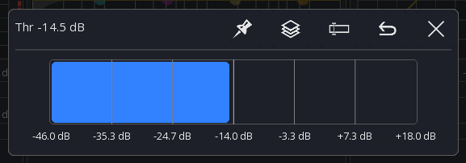

# UI Controls
This page shows the most common UI controls and how to use them

## Knobs

- **Drag** to change the value
- **Press and hold** to open a popup for more precise control
- **Double tap** to reset the value to the default

Knob values can be increased by dragging them up or to the right.
When dragging to the top right, the values will increase more rapidly.
To decrease the value just use the opposite direction as shown in the image below.

## Faders
- GEQ: **Double tap** to reset the value

If the **fine mode** is enabled you can start dragging the fader from any position and the movements will be more precise.

## Sliders
- **Double tap** to reset the value to the default
- **Drag** to change the value

Sliders are used in some FX views and in the knob popup described above.
The white line indicates the default value for this parameter.

## Channel buttons
The behavior of these button can be configured in the [app settings](app-settings.md).
Default behavior:

- **Tap** Open channel details
- **Press and hold** Open scribble strip

## Mixer sidebar
Contains two **scrollable** bars for layer and access to [sends on faders](sends-on-faders.md)

### Fine mode
Toggles the fine mode. This will affect every channel fader in the app.

### Mute enable
Toggles the mute enable mode. This will enable/disable every channel mute button in the app.

### Layer buttons
Each button provides access to a single layer

- **Tap** Select layer
- **Press and hold** Edit this layer

## Menu bar
The top menu provides access to other views and options. Depending on the current platform and view you're in the items will change.

**On Android:** If you're using an android device with a dedicated menu button you need to press it to access other menu items.

### Status
On the left side the current view and additional information are shown

### Menu items
The menu items are shown in a fixed order. If too many items are in the menu, they will be hidden and a `...` item is shown to access other items.

## Quick access
### Mute groups
You can always open the mute groups from any view by **double tapping with two fingers** anywhere
on the screen

### Clear solo
**Press and hold** the solo button to clear all solo.
The button can be enabled in the channel strip via the [app settings](app-settings.md).

