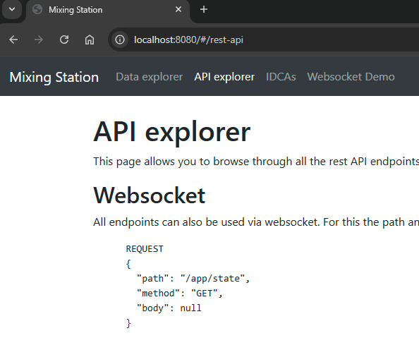

# APIs

Mixing Station provides different {{ abbr('API') }}s for integration with external software and hardware.
The goal of these APIs is to cover the majority of console parameters with a unified API, allowing your application to
work with every mixer supported by Mixing Station.

## Overview

Note that the *full* set of APIs is only available in the desktop version of Mixing Station.

| API  | Protocol            | Features                                                   |
|------|---------------------|------------------------------------------------------------|
| REST | http and websockets | App interaction, Mixer parameters, subscriptions, metering |
| OSC  | OSC via UDP         | Mixer parameters, subscriptions                            |

## Configure APIs

To enable {{ abbr('API') }} access, open the [global app settings](../settings/global.md) and enable {{ abbr('REST') }}
and/or {{ abbr('OSC') }}. Here you can also change the port number used by the APIs.

## Data Types

The following data types are used:

| Type     | Sample     |
|----------|------------|
| bool     | true/false |
| float    | 1.20       |
| long/int | 1          |
| string   | "hello"    |

There are two different value formats that can be used

| Format       | Description                                   | 
|--------------|-----------------------------------------------|
| Plain values | The actual value of the parameter (e.g. -5dB) |
| Normalized   | The value is normalized within the range 0-1  |

## REST

The REST API allows access via HTTP or websockets using json-encoded data.

### API Documentation

The full API documentation can be viewed via the REST api:

1. Enable the `HTTP REST` api in the global app settings
2. Open the following URL in your browser: `http://localhost:<your-configured-port>`

The webpage describes all available API endpoints and allows you to explore all data exposed by Mixing Station.
It also provides some sample UI which uses websockets to interact with Mixing Station.


### Websockets

Websocket requests use the following json scheme:

```json
{
  "path": "/app/state",
  "method": "GET",
  "body": null
}
```

Where `path` is the path of the API endpoint that you want to call, `method` is the
corresponding http method and `body` the payload.

The response will look like this:

```json
{
  "path": "/app/state",
  "method": "GET",
  "body": {},
  "error": null
}
```

Where `body` contains the payload of the response, and `error` contains any
error messages that occurred during processing your request.

#### Value subscriptions

To receive value updates you'll need to subscribe first.
A subscription describes a parameter path for which the client will
receive updates in case of values changes.
Requesting a new subscription will also send you the initial value(s).

Examples for value subscriptions can be found below in the [examples section](#examples).

## OSC

The OSC interface provides access to the mixer parameters.
You can see all available parameters by opening the data explorer (follow the REST API steps above and open the
webpage).

Note that OSC bundles are **not** supported.

### Syntax

The following syntax is used to describe the OSC packets:

- `[]` Can be one of the chars inside.
- `{}` Placeholder which must be replaced with a value.
- OSC uses `0` bytes for padding. For better readability these padding bytes are not indicated below.

### Subscribe

Send the following packet at least once every 5 seconds to get updates for all parameters.
The last char determines the formatting

Plain value

```
/hi/v
```

Normalized value

```
/hi/n
```

### Get data

A OSC packet without any parameters is used to request the current value.

```
/con/[vn]/{dataPath}
```

### Set data

Setting the data is similar to getting but with additional parameters.
You can use any of the supported data types described above.

```
/con/[vn]/{dataPath} f 0.0
```

## Examples

Here are some examples. For more details about the specific
API commands, please open the [API Documentation](#api-documentation) of mixing station.

### Websocket

Subscribe to the fader value of all channels:

```json
{
  "path": "/console/data/subscribe",
  "method": "POST",
  "body": {
	"path": "ch.*.mix.lvl",
	"format": "val"
  }
}
```

### OSC

This section shows example OSC packets.
Please keep in mind that OSC packets needs to
be [properly padded](https://opensoundcontrol.stanford.edu/spec-1_0.html#introduction)

Get fader of ch 1 as dB value

```
/con/v/ch.0.mix.lvl
```

Get fader of ch 1 as normalized value

```
/con/n/ch.0.mix.lvl
```

Set fader of ch 1 using a dB value

```
/con/v/ch.0.mix.lvl f -5
```

Set fader of ch 1 using a normalized value

```
/con/n/ch.0.mix.lvl f 0.5
```

## Metering

Using the websocket API you can also request metering data from mixing station.

### Subscribe

To receive metering data, you'll need to subscribe to the metering data:

```json
{
  "path": "/console/metering2/subscribe",
  "method": "POST",
  "body": {
	"id": 0,
	"interval": 100,
	"binary": true,
	"params": [
	  {
		"type": 0,
		"index": 0
	  }
	]
  }
}
```

The request payload is defined as:

| Field          | Description                                                                                                       | 
|----------------|-------------------------------------------------------------------------------------------------------------------|
| id             | ID which identifies the subscription                                                                              |
| interval       | The interval parameter defines the data rate in milliseconds (global per client, last one wins, min:30, max:1000) |
| binary         | true will cause the reply to contain a base64 encoded string (non-padded).                                        |
| params.*.type  | Metering type                                                                                                     |
| params.*.index | Index of the type, out of bound requests will be ignored                                                          |

A single subscription may return a maximum of 500 metering values.

To unsubscribe / clear a subscription you can either call subscribe again with an empty `params` list, or call

```text
POST /console/metering/unsubscribe {id: 0}
```

#### Metering type

The metering type defines what type of metering will be sent back. This also defines the data format
for this requested meter.

| Type | Description                                                                                          |
|------|------------------------------------------------------------------------------------------------------|
| 0    | Channel mixer meters. This will be the input/output levels, as shown by mixing station in the mixer. | 
| 1    | Same as 1 but with 4 additional meters for Gate/Dyn SC Input and GR                                  |
| 10   | RTA                                                                                                  |

The data will be sent via websocket to the path `/console/metering2/{id}`

#### Json format

The `binary=false` response payload is defined as:

```json
{
  "path": "/console/metering2/0",
  "body": {
	"v": [
	  [
		-20
	  ]
	]
  }
}
```

where `v` is an array containing the responses of all `params.*` in the subscription. Each entry in this array
is another array containing all values of that single parameter. So for a stereo channel it will include 2 values,
for a mono channel 1.

The order of the values in the array is as follows:

```text
Type 0: ch-meter-L, [ch-meter-R]
Type 1: ch-meter-L, [ch-meter-R] [gate input, gate gr, comp input, comp gr]
        If a channel has no gate, nor dynamics none of the parameters will be included.
        If it only has a gate, only the gate part will be included.
        If it only has a comp, both the gate and comp part will be included (so the values can be differentiated).
        
Type 10: rta-band-0, rta-band-1, ...

Where [...] denotes an optional value which will only be included if available.
All values are in dB, gain reduction values are negative.

Inactive channels (for example if a mixer merges two channels into one) will still be included in the request.

```

#### Binary format

The binary format follows the same value order as defined in the Json format above,
however instead of using arrays, all values will be encoded using non-padded base64,
where each value is encoded as:

```text
int16 big endian, scaled by 100 (so 1.02dB -> 102)
```

The `binary=true` response payload is defined as:

```json
{
  "path": "/console/metering2/0",
  "body": {
	"b": "...base64..."
  }
}
```

#### RTA

The number of RTA bands and their frequencies can be queried using the
console information endpoint.


## MS Scenes

You can get the current console state in the MS Scene format using the corresponding endpoints.
When recalling a scene the data will be applied asynchronously.
The app will update the state messages to reflect the progress (via websockets):
```json
{ "msg": "", "progress": 0, "state": "sceneRecall", "topState": "connected" }
```

Once the recall has been completed (state changes back to something else) you can verify if there have been any
recall errors using the `lastError` endpoint.