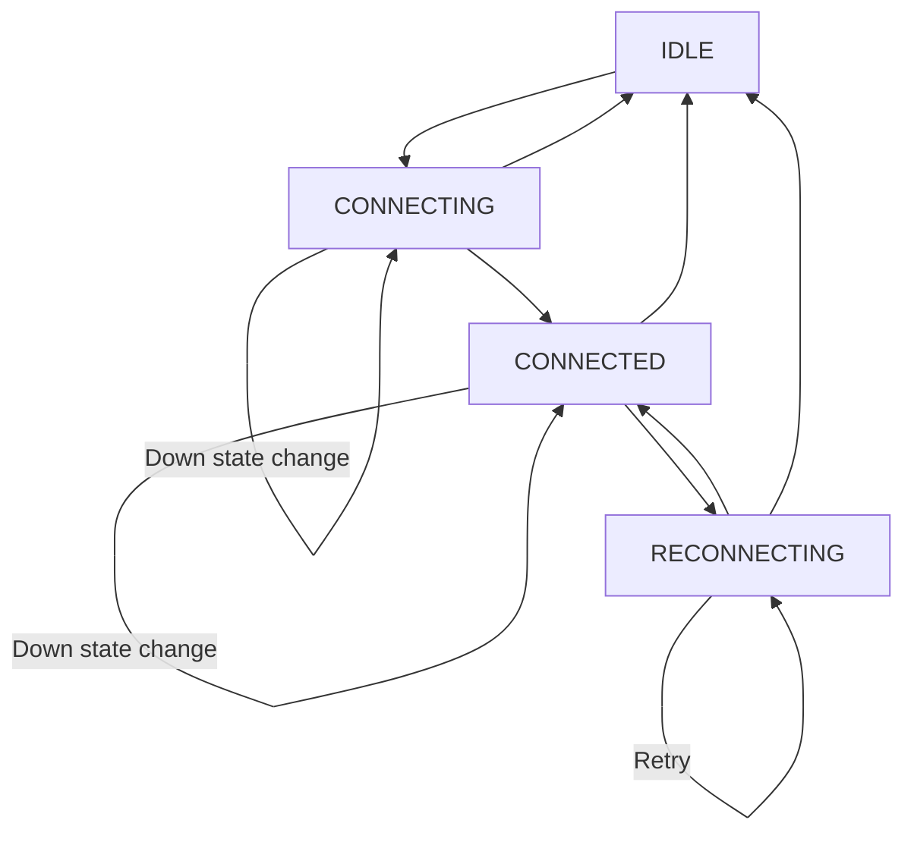
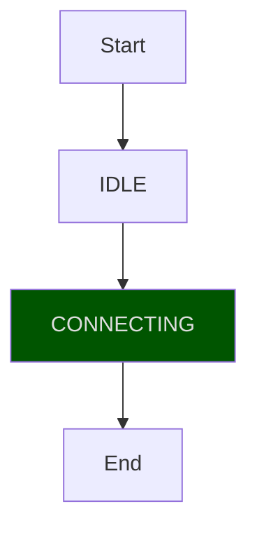
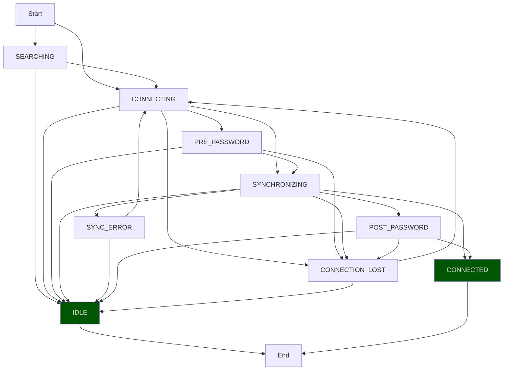
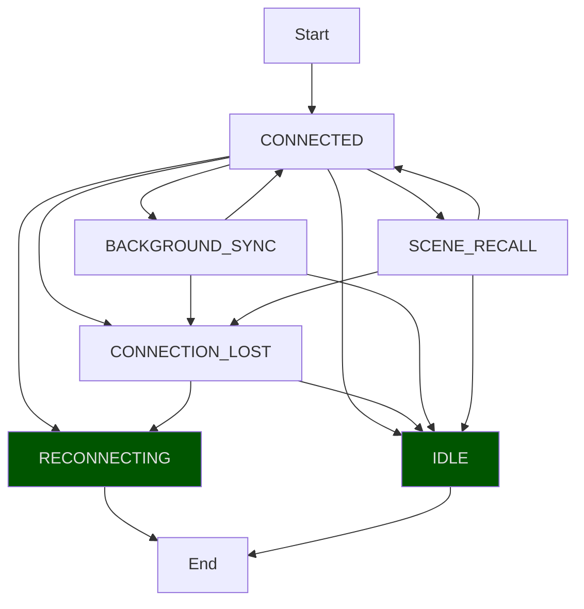
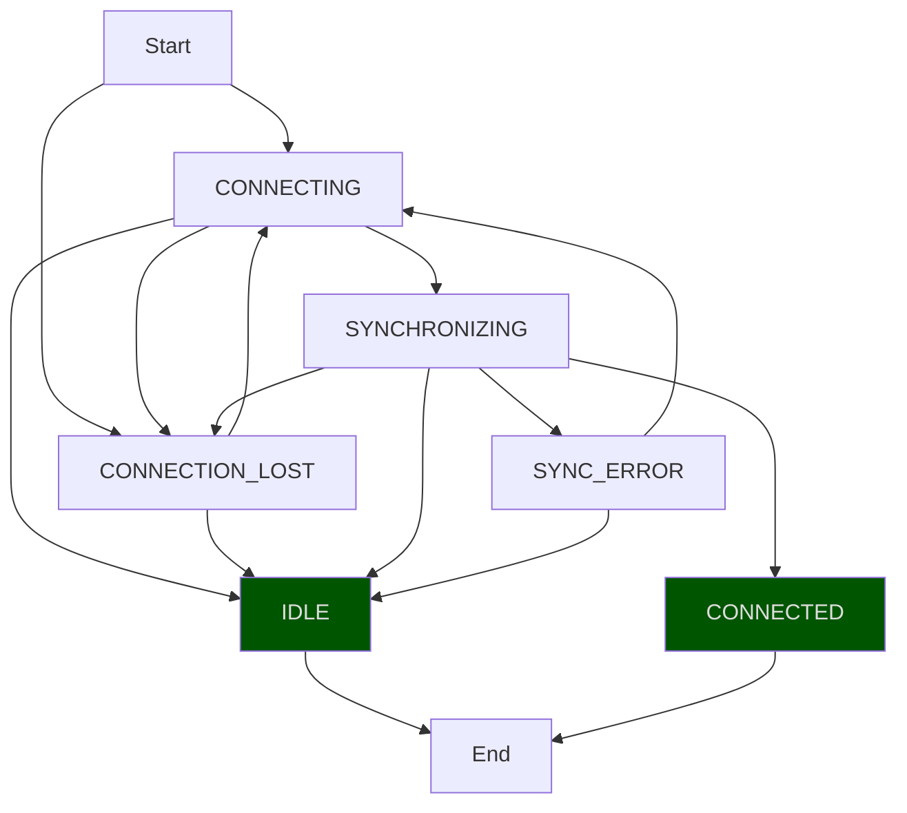

# APIs - App States

This page shows all possible app states and
their transitions.

This information is only relevant if you plan on using the API feature.

## Top States

## Top State: IDLE

## Top State: CONNECTING

## Top State: CONNECTED

## Top State: RECONNECTING

