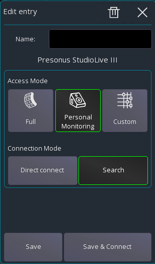
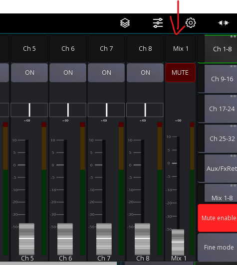

# Personal Monitoring

Mixing Station allows you to mix your own monitor mix, without affecting other mixes by accident.

To use the personal monitoring feature, open the [connection profile](../getting-started#connection-profiles)
and select `Personal Monitoring`:

This will ensure that you're only editing your own mix.

## Access main EQ

If you're using IEM and want to access the EQ of your monitor output, make sure `Bus processing`
in the [global settings](../settings/global.md) is enabled.

## Hide bus fader

By default you'll see your bus master fader on the right side:

if you don't want that you can hide it in the [global settings](../settings/global.md).

## Access channel EQ

In personal monitoring mode you can't access any input channel processing (for example EQ) as
this would affect the FoH output as well. This is how most digital mixers work and nothing that can be changed.

## Using layouts

Layouts will not be accessible when using personal monitoring mode. This is by design as otherwise they
would bypass the access restrictions.