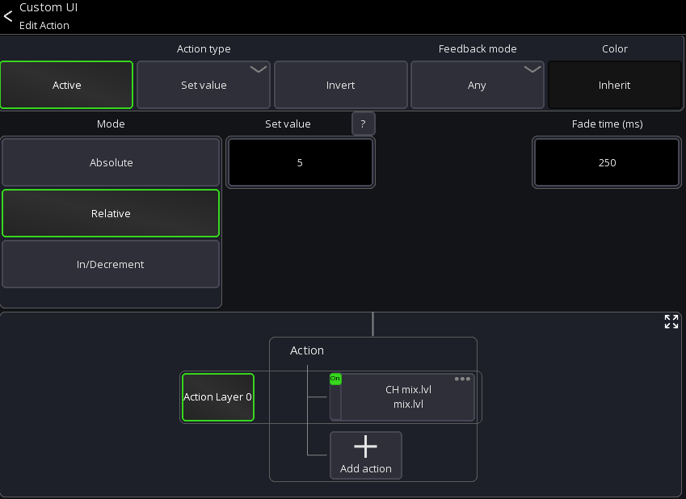
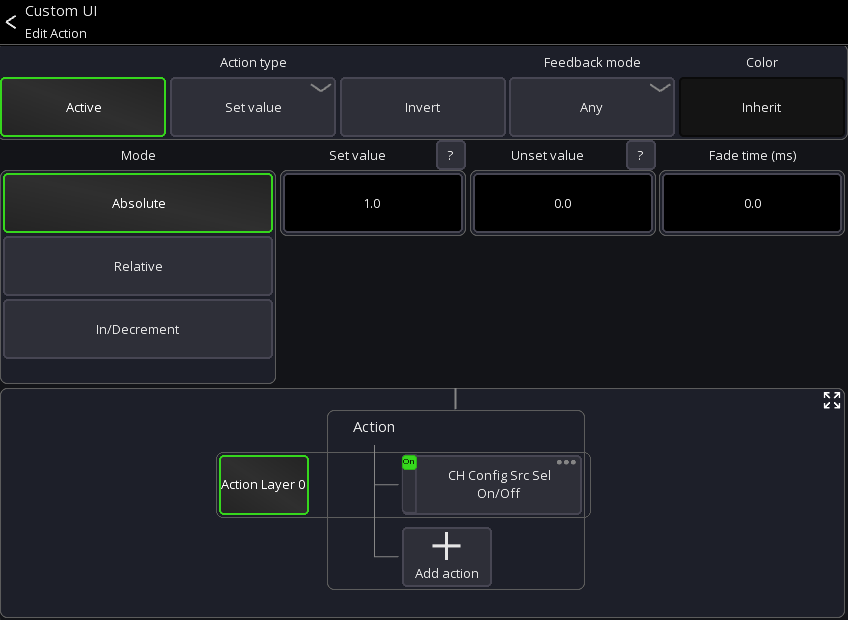

# Set Value action examples

This page provides some examples how the `Set value` action can be used.

## Boost button

Boost a fader by +5dB and decrease again

1. Add a new custom button to your [layout](../custom-layouts.md).
2. Assign the `Set value` action to the button
3. Use `Relative` mode and set `Set value` to `5`
4. Assign the `Current channel->Main->Fader` action to the `Set value` action

## Changing Alt Input Source

You can create a button to change the input source of a channel to the "alt" input (if your mixer has that
functionality).

1. Add a new custom button to your [layout](../custom-layouts.md).
2. Assign the `Set value` action to the button
3. Use `Absolute` mode and set `Set value` to `1` and `Unset value` to 0
4. Set the `Fade time` to `0`
5. Assign the `Current channel->Config->Src Sel` action to the `Set value` action

Here is the full configuration:

