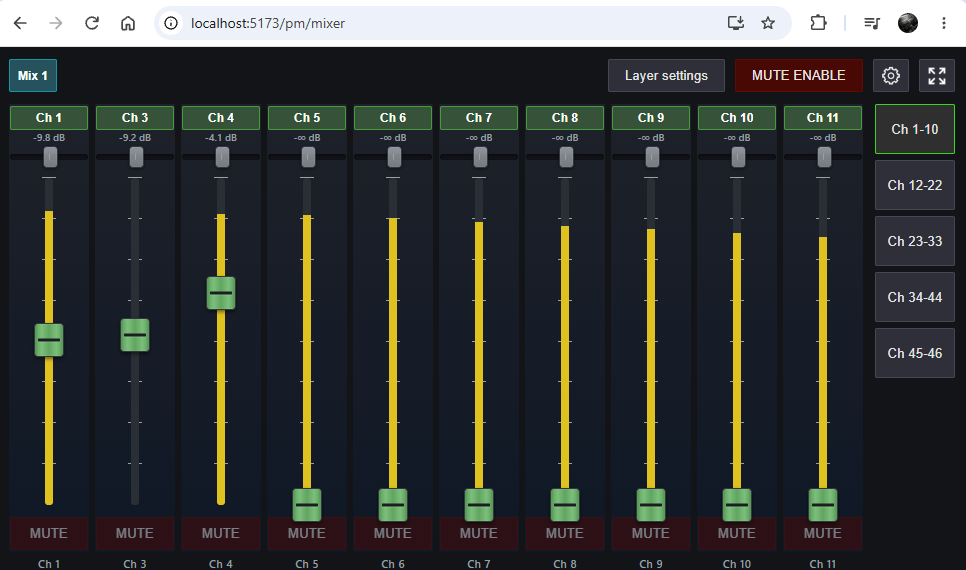
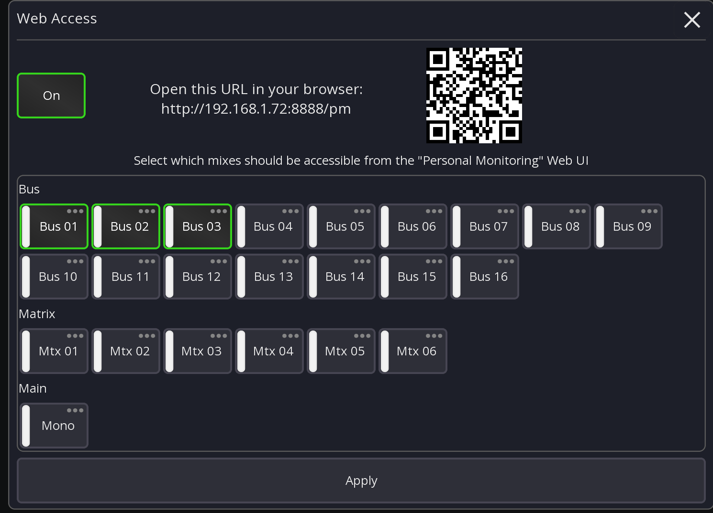

# Web Access

The desktop version of Mixing Station can provide a web interface for personal monitoring.

This is perfect for venues and sound engineers who want to allow performers to mix their own mix,
but don't want them to install any app or access anything else of the mixer.



It can only control the monitor mixes you configure,
and only provides access to level, pan and send mutes.

Layers are configured automatically based on screen size
but can be adjusted if required. Settings are stored inside the browser.

## Requirements

- Mixing Station subscription
- Your desktop system must be accessible from the Wi-Fi used by the performers

## Configuration



1. Open Mixing Station and connect/start offline mode with any mixer
2. In the main Mixer menu press "Web Access"
3. Select the mixes that should be accessible via the website
4. Press "Apply"

Tip: Click on the QR-Code to show a larger version. You can even print the QR code and hang is somewhere (assuming the IP address of the system running
mixing station is fixed).

## Network security

Depending on how much security you want to add, you can split the web-access completely from the
console internal network. This requires a bit more network knowledge but the benefit
is that even if the musicians have installed the app of your mixer, they won't be able to connect.

Example:

```txt
Mixer   <------>   Mixing Station    <----->   Web Access
               Desktop (Win/Mac/Linux)       Any browser
192.168.0.1    192.168.0.2  |  10.1.1.1        10.1.1.2
```

## API Access (advanced)

When enabling the "web access" feature, all other API access will be rejected.
If you still need the API to do other stuff (for example the companion integration) you want to
set a password for the admin user and enable API-Write permissions again.

This can be done by opening the [global settings](../settings/global.md#permissions)